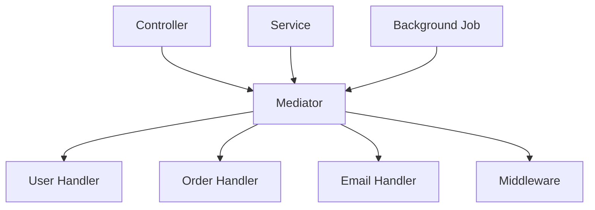

# What is Foundatio.Mediator?

Foundatio.Mediator is a high-performance, convention-based mediator pattern implementation for .NET applications. It leverages modern C# features like source generators and interceptors to deliver near-direct call performance while maintaining the benefits of the mediator pattern.

## What is the Mediator Pattern?

The mediator pattern defines how a set of objects interact with each other. Instead of objects communicating directly, they communicate through a central mediator. This promotes loose coupling and makes your code more maintainable and testable.



## Key Benefits

### 🚀 Exceptional Performance

Foundatio.Mediator uses **C# interceptors** to transform mediator calls into direct method calls at compile time:

```csharp
// You write this:
await mediator.InvokeAsync(new GetUser(123));

// The generator transforms it to essentially:
await UserHandler_Generated.HandleAsync(new GetUser(123), serviceProvider, cancellationToken);
```

This results in performance that's **2-15x faster** than other mediator implementations.

### ⚡ Convention-Based Discovery

No interfaces or base classes required. Just follow simple naming conventions:

```csharp
// ✅ This works - class ends with "Handler"
public class UserHandler
{
    // ✅ Method named "Handle" or "HandleAsync"
    public User Handle(GetUser query) { /* ... */ }
}

// ✅ This also works - static methods
public static class OrderHandler
{
    public static async Task<Order> HandleAsync(CreateOrder cmd) { /* ... */ }
}
```

### 🔧 Seamless Dependency Injection

Full support for Microsoft.Extensions.DependencyInjection with both constructor and method injection:

```csharp
public class UserHandler
{
    // Constructor injection for long-lived dependencies
    public UserHandler(ILogger<UserHandler> logger) { /* ... */ }

    // Method injection for per-request dependencies
    public async Task<User> HandleAsync(
        GetUser query,
        IUserRepository repo,  // Injected from DI
        CancellationToken ct   // Automatically provided
    ) { /* ... */ }
}
```

### 🎯 Rich Result Types

Built-in `Result<T>` discriminated union for robust error handling without exceptions:

```csharp
public Result<User> Handle(GetUser query)
{
    var user = _repository.FindById(query.Id);

    if (user == null)
        return Result.NotFound($"User {query.Id} not found");

    if (!user.IsActive)
        return Result.Forbidden("User account is disabled");

    return user; // Implicit conversion to Result<User>
}
```

### 🎪 Powerful Middleware Pipeline

Cross-cutting concerns made easy with Before/After/Finally hooks:

```csharp
public class ValidationMiddleware
{
    public HandlerResult Before(object message)
    {
        if (!IsValid(message))
            return Result.Invalid("Validation failed"); // Short-circuit

        return HandlerResult.Continue();
    }
}

public class LoggingMiddleware
{
    public Stopwatch Before(object message) => Stopwatch.StartNew();

    public void Finally(object message, Stopwatch sw, Exception? ex)
    {
        _logger.LogInformation("Handled {MessageType} in {Ms}ms",
            message.GetType().Name, sw.ElapsedMilliseconds);
    }
}
```

## How It Works

### Dual Dispatch Strategy

Foundatio.Mediator uses a **dual dispatch strategy** for maximum performance and flexibility:

1. **Same-Assembly Calls**: Use C# interceptors for blazing fast execution
2. **Cross-Assembly & Publish**: Fall back to DI registration lookup

### Compile-Time Code Generation

The source generator:

1. **Discovers handlers** by scanning for classes ending with `Handler` or `Consumer`
2. **Validates signatures** ensuring proper method names and parameters
3. **Generates interceptors** for same-assembly direct method calls
4. **Creates DI registrations** for cross-assembly and publish scenarios
5. **Provides diagnostics** for missing handlers and configuration issues

### Zero Runtime Overhead

Unlike other mediator libraries that use reflection or delegates at runtime, Foundatio.Mediator's interceptors have:

- ✅ **Zero allocations** for fire-and-forget commands
- ✅ **No boxing** of value types
- ✅ **No delegate overhead**
- ✅ **Direct method calls** with full inlining potential
- ✅ **Complete type safety** with compile-time verification

## When to Use Foundatio.Mediator

### ✅ Great For

- **Clean Architecture** applications with command/query separation
- **Microservices** with clear request/response boundaries
- **Event-driven** architectures with publish/subscribe patterns
- **High-performance** scenarios where every nanosecond matters
- **Large teams** needing consistent patterns and conventions
- **Testing** scenarios requiring isolated, mockable handlers

### ⚠️ Consider Alternatives For

- **Simple CRUD** applications with minimal business logic
- **Performance-critical** inner loops where even 10ns matters
- **Legacy codebases** that can't adopt modern .NET features
- **Teams resistant** to convention-based approaches

## Comparison with Other Libraries

| Feature | Foundatio.Mediator | MediatR | MassTransit |
|---------|-------------------|---------|-------------|
| **Performance** | 🟢 Near-direct calls | 🟡 Moderate | 🔴 Heavy overhead |
| **Setup Complexity** | 🟢 Minimal | 🟢 Simple | 🔴 Complex |
| **Convention-Based** | 🟢 Yes | 🔴 Interface-based | 🔴 Configuration-heavy |
| **DI Integration** | 🟢 Seamless | 🟢 Good | 🟡 Requires setup |
| **Cross-Assembly** | 🟢 Supported | 🟢 Supported | 🟢 Designed for it |
| **Middleware** | 🟢 Built-in pipeline | 🟡 Behaviors only | 🟢 Rich pipeline |
| **Error Handling** | 🟢 Result&lt;T&gt; types | 🔴 Exception-based | 🟡 Mixed approach |

## Next Steps

Ready to get started? Here's what to explore next:

- [Getting Started](./getting-started) - Set up your first handler
- [Handler Conventions](./handler-conventions) - Learn the discovery rules
- [Examples](../examples/simple-handlers) - See practical implementations
