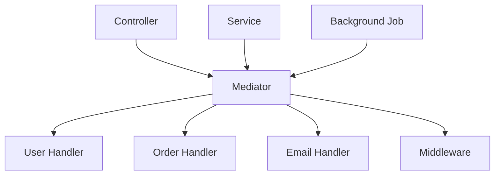

# What is Foundatio Mediator?

Foundatio Mediator is a convention-based mediator library for .NET that makes it easy to build loosely coupled, maintainable, and testable applications — without sacrificing performance or drowning in boilerplate. It leverages source generators and C# interceptors to deliver near-direct call performance at runtime while giving your team clean architectural boundaries at design time.

## The Problem: How Codebases Become Unmaintainable

Every application starts clean. A controller calls a service, the service calls a repository, and everything is easy to follow. But as the application grows, things get tangled:

- **Services call other services**, creating a web of direct dependencies that's hard to trace and harder to change
- **Business logic spreads** across controllers, services, and helpers with no clear boundaries
- **Testing becomes painful** — to test one class, you need to mock a chain of dependencies it was never designed to work without
- **Changes ripple unpredictably** — a small modification in one service breaks three others that depend on it directly
- **New team members struggle** to understand what calls what and where a feature actually lives

This is the **big ball of mud** — and it's the natural outcome when components communicate directly instead of through clear, well-defined boundaries.

## The Mediator Pattern: A Way Out

The mediator pattern solves this by introducing a simple rule: **components never call each other directly**. Instead, they send messages through a central mediator, and handlers pick them up on the other side.


```mermaid
graph TD
    A[Controller] --> M[Mediator]
    B[Service] --> M
    C[Background Job] --> M
    M --> H1[User Handler]
    M --> H2[Order Handler]
    M --> H3[Email Handler]
    M --> MW[Middleware]
```

This single change has profound effects:

- **Loose coupling** — The sender doesn't know (or care) who handles the message. You can change, replace, or remove handlers without touching callers.
- **Compose with events** — Publish an event like `OrderCreated` and any number of handlers react — sending emails, updating inventory, writing audit logs — without knowing about each other. Add new behavior without modifying existing code.
- **Clear boundaries** — Each handler does one thing. Business logic has an obvious home.
- **Easy testing** — Handlers are self-contained. Test them in isolation with real assertions, not mock verification chains.
- **Safe refactoring** — Rename, split, or reorganize handlers without breaking the rest of the app.

The catch? Traditional mediator libraries make you pay for these benefits with boilerplate interfaces, runtime reflection overhead, and framework lock-in. Foundatio Mediator eliminates those costs.

## Key Benefits

### 🚀 Exceptional Performance

Foundatio Mediator uses **C# interceptors** to transform mediator calls into direct method calls at compile time:

```csharp
// You write this:
await mediator.InvokeAsync(new GetUser(123));

// The generator transforms it to essentially:
await UserHandler_Generated.HandleAsync(new GetUser(123), serviceProvider, cancellationToken);
```

This results in performance that's **2-15x faster** than other mediator implementations and very close to direct method call performance.

### ⚡ Convention-Based Discovery

No interfaces or base classes required. Just follow simple naming conventions:

```csharp
// ✅ This works - class ends with "Handler"
public class UserHandler
{
    // ✅ Method named "Handle" or "HandleAsync"
    public User Handle(GetUser query) { /* ... */ }
}

// ✅ This also works - static methods
public static class OrderHandler
{
    public static async Task<Order> HandleAsync(CreateOrder cmd) { /* ... */ }
}
```

Unlike traditional mediator libraries that lock you into rigid interface contracts, conventions give you **unprecedented flexibility**:

- **Sync or async** - Return `void`, `Task`, `T`, `Task<T>`, `ValueTask<T>`
- **Any parameters** - Message first, then any dependencies injected automatically
- **Multiple handlers per class** - Group related operations naturally
- **Static handlers** - Zero allocation for stateless operations
- **Tuple returns** - Cascading messages for event-driven workflows

```csharp
// All of these are valid handlers:
public int Handle(AddNumbers q) => q.A + q.B;                    // Sync, returns value
public void Handle(LogMessage cmd) => _log.Info(cmd.Text);       // Fire-and-forget
public async Task<User> HandleAsync(GetUser q, IRepo r) => ...;  // Async with DI
public (Order, OrderCreated) Handle(CreateOrder c) => ...;       // Cascading events
```

### 🔧 Seamless Dependency Injection

Full support for Microsoft.Extensions.DependencyInjection with both constructor and method injection:

```csharp
public class UserHandler
{
    // Constructor injection for long-lived dependencies
    public UserHandler(ILogger<UserHandler> logger) { /* ... */ }

    // Method injection for per-request dependencies
    public async Task<User> HandleAsync(
        GetUser query,
        IUserRepository repo,  // Injected from DI
        CancellationToken ct   // Automatically provided
    ) { /* ... */ }
}
```

### 🎯 Rich Result Types

Built-in `Result<T>` discriminated union for robust error handling without exceptions:

```csharp
public Result<User> Handle(GetUser query)
{
    var user = _repository.FindById(query.Id);

    if (user == null)
        return Result.NotFound($"User {query.Id} not found");

    if (!user.IsActive)
        return Result.Forbidden("User account is disabled");

    return user; // Implicit conversion to Result<User>
}
```

### 🎪 Powerful Middleware Pipeline

Cross-cutting concerns made easy with Before/After/Finally/Execute hooks:

```csharp
public class ValidationMiddleware
{
    public HandlerResult Before(object message)
    {
        if (!IsValid(message))
            return HandlerResult.ShortCircuit(Result.Invalid("Validation failed"));

        return HandlerResult.Continue();
    }
}

public class LoggingMiddleware
{
    public Stopwatch Before(object message) => Stopwatch.StartNew();

    public void Finally(object message, Stopwatch sw, Exception? ex)
    {
        _logger.LogInformation("Handled {MessageType} in {Ms}ms",
            message.GetType().Name, sw.ElapsedMilliseconds);
    }
}
```

## What This Means for Your Team

The features above aren't just technical checkboxes — they translate directly into a healthier codebase and a more productive team:

- **Avoid the big ball of mud** — Message-based communication enforces boundaries that prevent the tight coupling that makes large codebases unmaintainable. Your code stays organized as it grows.
- **Compose logic through events** — When an order is created, the email handler, audit handler, and inventory handler all react independently. None of them know about each other. Need a new reaction? Add a handler — no existing code changes.
- **Ship changes confidently** — When handlers are self-contained and loosely coupled, you can modify one feature without worrying about breaking others. Refactoring goes from scary to routine.
- **Test without fighting the framework** — Handlers are plain classes. Write focused unit tests that assert on real behavior, not mock setups. No mediator fakes, no DI container in tests.
- **Onboard developers faster** — Clear conventions mean new team members learn the pattern once and can navigate the entire codebase. Every feature follows the same structure: message in, handler processes, result out.
- **No performance penalty for good architecture** — Unlike other mediator libraries that add measurable overhead per call, Foundatio Mediator compiles away the indirection. You get a well-structured codebase that runs as fast as hand-wired code.
- **No boilerplate tax** — No marker interfaces, no base classes, no manual DI registration. The source generator handles the wiring so you can focus on business logic.

## When to Use Foundatio Mediator

### ✅ Great For

- **Any app that needs to stay maintainable** as it grows beyond a handful of services
- **Clean Architecture** applications with command/query separation
- **Microservices** with clear request/response boundaries
- **Event-driven** architectures with publish/subscribe patterns
- **Large teams** needing consistent patterns and conventions
- **High-performance** scenarios where mediator overhead is usually accepted as a cost of good architecture

### ⚠️ Consider Alternatives For

- **Simple CRUD** applications with minimal business logic
- **Performance-critical** inner loops where even 10ns matters
- **Legacy codebases** that can't adopt modern .NET features

> **Note:** If you prefer explicit interfaces over conventions, Foundatio Mediator fully supports that too! Use `IHandler` marker interface or `[Handler]` attributes, and optionally disable conventional discovery. See [Handler Conventions](./handler-conventions#explicit-handler-declaration) for details.

## Next Steps

Ready to get started? Here's what to explore next:

- [Getting Started](./getting-started) - Set up your first handler
- [Handler Conventions](./handler-conventions) - Learn the discovery rules
- [Samples](../samples/) - See practical implementations
